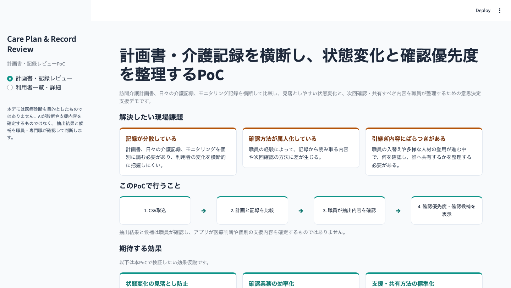
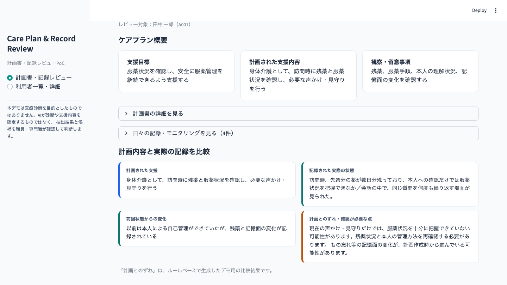
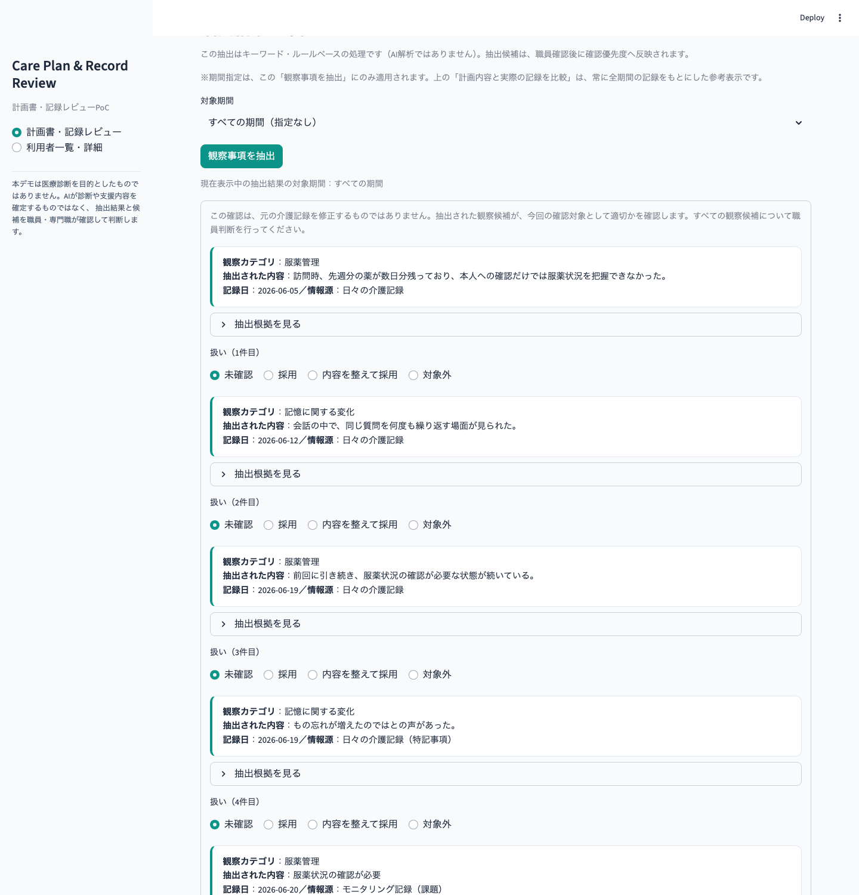
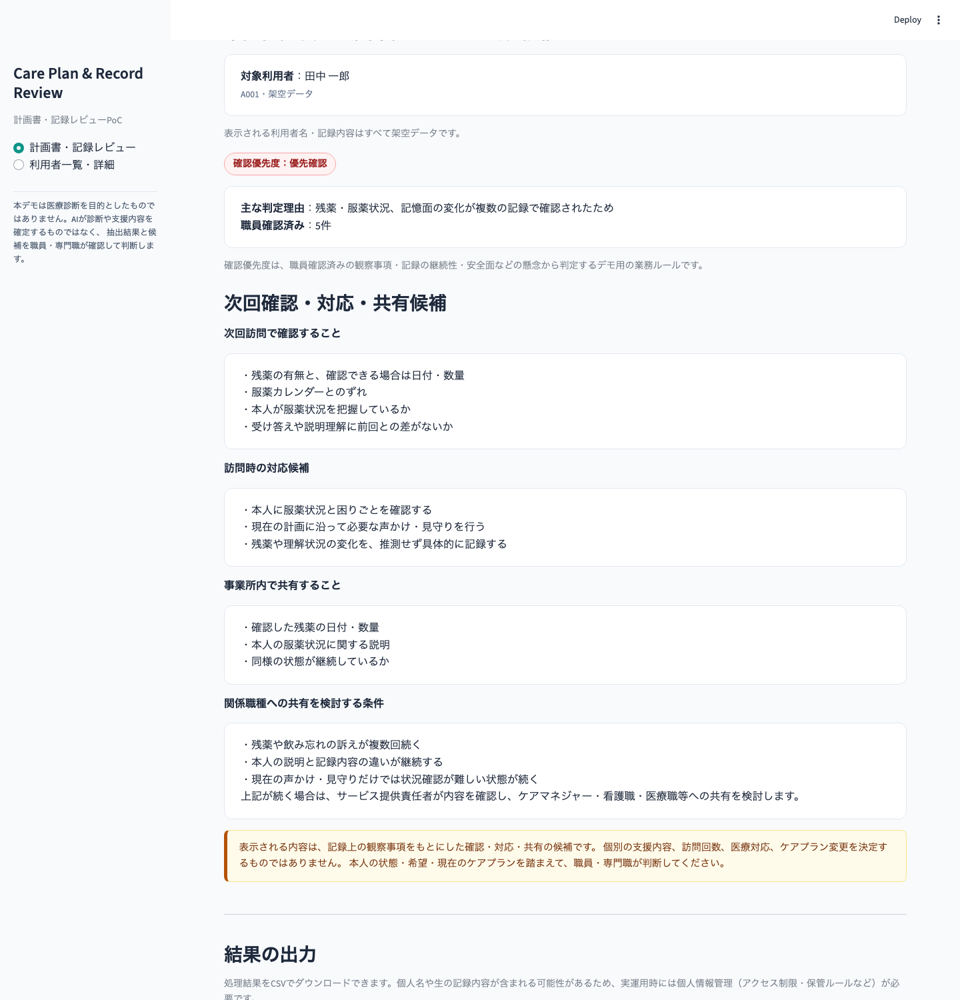
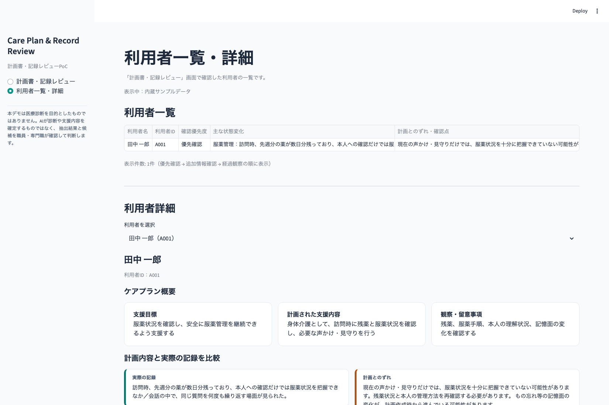

# 計画書・介護記録を横断し、状態変化と確認優先度を整理するPoC

Care Plan & Record Review PoC
### ▶ [Streamlitデモを開く](https://care-plan-record-review.streamlit.app)

[](https://care-plan-record-review.streamlit.app)

訪問介護計画書、日々の介護記録、モニタリング記録を利用者単位で統合し、計画内容と実際の記録との差や状態変化候補を整理するPoCです。抽出結果を職員が確認した後、確認優先度と、次回確認・対応・共有候補を表示します。

- 現在の自動抽出は生成AIではなく、キーワードと業務ルールを用いたルールベース処理です
- 医療診断は行いません
- 個別の支援内容を自動決定しません
- ケアプラン変更を確定しません
- 最終判断は職員・専門職が行います
- 公開デモの利用者名・記録内容はすべて架空データです
- 現在はCSV取込によって外部データ連携を再現しています

<p align="center">
  
</p>

---

## 解決したい現場課題

### 記録が分散している
計画書、日々の介護記録、モニタリングを個別に確認する必要があり、状態変化を横断的に把握しにくい。

### 確認方法が属人化している
職員の経験によって、記録から読み取る内容や確認方法に差が生じる。

### 引継ぎ・共有内容にばらつきがある
何を確認し、どの事実を共有するかが職員によって異なる。

## このPoCで行うこと

```
CSV取込
 → 計画書・記録・モニタリングを利用者単位で統合
 → 状態変化候補をルールベースで抽出
 → 職員が採用・修正・対象外を確認
 → 確認優先度を整理
 → 次回確認・対応・共有候補を表示
 → 結果CSVを出力
```

## 3分で確認できる見どころ

1. 内蔵サンプルデータを選択する
2. A001を選択する
3. ケアプラン概要と日々の記録を確認する
4. 計画内容と実際の記録の比較を見る
5. 対象期間を選び、「観察事項を抽出」を実行する
6. 未確認の候補について、採用・内容を整えて採用・対象外のいずれかを選択する
7. 確認優先度と次回確認・対応・共有候補を見る
8. 利用者一覧・詳細で複数利用者を比較する
9. 必要に応じて結果CSVをダウンロードする

<p align="center">
  
</p>

## 主な機能

- 内蔵サンプルデータ（A001〜D001）
- CSVアップロード（U101〜U103のCSV取込確認用サンプルを同梱）
- 文字コード判定
- 列名マッピング（別名の列名をアプリ内の標準列へ変換）
- 必須項目・利用者ID・日付の確認
- 計画書と実際の記録の比較（計画とのずれの表示。常に全期間の記録を対象とする参考表示）
- 観察事項抽出の対象期間指定（すべての期間／今日／過去7日間／今月／前月／期間を指定）
- ルールベースによる観察候補抽出（抽出元は日々の介護記録・モニタリング記録のみで、計画書の記載内容は含めない）
- 抽出根拠の表示（一致したキーワードと適用カテゴリ）
- 職員による未確認／採用／内容を整えて採用／対象外の判断（未確認が残っている間は確認結果を確定できないHuman-in-the-loop設計）
- 確認優先度（優先確認／追加情報確認／経過観察）の表示
- 次回確認・対応・共有候補の表示
- 利用者一覧・詳細（複数利用者の比較）
- 結果CSVの出力
- サンプルモードとCSVアップロードモードのセッション状態分離

## サンプルケース

| 利用者ID | 主なケース | 想定区分 |
|---|---|---|
| A001 | 服薬管理・残薬・記憶面の変化 | 優先確認 |
| B001 | 排泄・皮膚状態の変化 | 優先確認 |
| C001 | 口腔ケアの軽微な変化 | 経過観察 |
| D001 | 記録はあり、状態変化候補なし | 経過観察 |
| U101 | 移動・立ち上がり・介助量の変化 | 優先確認 |
| U102 | 口腔ケアの軽微な変化 | 経過観察 |
| U103 | 記録・モニタリング情報不足 | 追加情報確認 |

A001〜D001は内蔵サンプルデータ、U101〜U103はCSVアップロードモードのCSV取込確認用サンプルです。

D001とU103は一見似ていますが、意味が異なります。

- **D001**：必要な記録は存在し、今回の抽出ルールでは明確な状態変化候補が検出されなかったケース
- **U103**：状態変化を判断するための記録・モニタリング情報が不足しているケース

「状態変化候補なし」と「情報不足」は区別して表示しています。

<p align="center">
  
</p>

## 処理ロジック

1. CSVの文字コードを判定して読み込む
2. 異なる列名をアプリ内の標準列へ変換する
3. 必須項目や日付、利用者IDを確認する
4. 利用者ID単位で計画書・記録・モニタリングを統合する
5. キーワードと業務ルールで状態変化候補を抽出する
6. 職員が採用・修正・対象外を判断する
7. 職員確認済みの情報から確認優先度を整理する
8. 次回確認・対応・共有候補を表示し、結果CSVを出力する

現在の抽出処理は、生成AIによる自由推論ではなく、説明可能性を重視したルールベース処理です。

## 確認優先度

- **優先確認**：安全面・服薬管理の懸念や、複数カテゴリの状態変化が記録で確認されたケース
- **追加情報確認**：状態変化を判断するための記録・モニタリング情報が不足しているケース
- **経過観察**：現時点で優先確認・追加情報確認のいずれにも該当しないケース

いずれも医療リスクや診断結果ではなく、職員が記録を確認する順番や、追加情報の必要性を整理するための業務上の区分です。

## 人間による確認

抽出された観察候補には、職員が次の4つから判断します。初期状態はすべて「未確認」です。

- **未確認**：まだ職員が判断していない初期状態
- **採用**：抽出内容をそのまま確認済みとする
- **内容を整えて採用**：文言を整えたうえで確認済みとする
- **対象外**：確認済み観察事項として扱わない

「対象外」とした候補は、確認優先度の判定・次回確認候補・確認済み観察事項CSVのいずれにも反映されません。1件でも「未確認」が残っている間は確認結果を確定できず、確認優先度も算出されません。ルールベース処理が結果を自動確定するのではなく、職員がすべての候補を確認したうえで反映するHuman-in-the-loop設計です。

## 次回確認・対応・共有候補

職員確認済みの観察カテゴリから、次の4区分でルールベースの候補を表示します。

- **次回訪問で確認すること**：まだ確認できていない、次回訪問時の確認候補
- **訪問時の対応候補**：現在のケアプランの範囲内での関わり方の候補
- **事業所内で共有すること**：記録で確認できた事実
- **関係職種への共有を検討する条件**：今後の共有を検討する目安となる条件

- 記録された事実と、未確認事項を区別して表示しています
- 本人主体の確認・対応候補を表示します
- 現在のケアプランの範囲を超える支援は自動決定しません
- 医療対応やケアプラン変更を指示しません
- 候補数を絞り、主な状態変化カテゴリを優先して表示します

**「事業所内で共有すること」は、職員が申し送りを書くための材料です。** 「確認した残薬の日付・数量」「本人の服薬状況に関する説明」「同様の状態が継続しているか」のように、記録で確認できた事実を申し送りに何を含めればよいかという形で整理しています。現時点では、完成した申し送り文章を自動生成する機能はありません。将来的には、職員が確認済みの共有候補をもとに申し送り文案を作成する機能を検討していますが、その場合も文案を自動送信することはなく、職員が内容を確認・修正・承認したうえで共有する設計を想定しています。

<p align="center">
  
</p>

## CSV出力

- **review_priority_results.csv**：利用者ごとの確認結果一覧。`user_id` / `user_name` / `operational_priority`（確認優先度） / `priority_reason`（主な判定理由） / `main_change` / `source_type` / `source_date` / `input_information_status` / `missing_information_detail` / `review_status` / `planned_support` / `actual_record_summary` / `plan_record_gap` / `next_visit_checks`（次回訪問で確認すること） / `visit_action_candidates`（訪問時の対応候補） / `office_share_items`（事業所内で共有すること） / `external_share_conditions`（関係職種への共有を検討する条件）を含みます。
- **confirmed_observations.csv**：職員確認済みの観察事項一覧。`user_id` / `user_name` / `observation_category` / `confirmed_observation` / `evidence_text` / `record_date` / `source_type` / `staff_decision` を含みます。

個人名や生の記録内容が含まれる可能性があるため、実運用時には個人情報管理（アクセス制限・保管ルールなど）が必要です。

<p align="center">
  
</p>

## 想定する業務効果とKPI仮説

以下はいずれも**効果仮説**であり、実証済みの実績数値ではありません。実運用時に検証することを想定しています。

### 想定する業務効果

1. **記録確認時間の削減**：複数の計画書・日々の記録・モニタリングを人手で横断的に読み返す負担を減らし、確認すべき利用者・項目に絞る。
2. **状態変化の見落とし防止**：複数日・複数記録にまたがる変化を整理し、職員が確認すべき兆候を把握しやすくする。
3. **確認業務の標準化**：職員経験だけに依存していた確認方法を、一定の業務ルールで整理する。
4. **申し送り・情報共有の支援**：記録された情報が個別記録の中で止まらず、次回訪問・事業所内共有・関係職種への相談検討へつながる仕組みを目指す。

### 実運用時に検証したいKPI（目標仮説）

| KPI | 目標仮説 |
|---|---|
| ① 1利用者あたりの記録確認時間 | 約1分で、状態変化候補と次回確認事項を確認できる状態を目指す（補助指標：平均確認時間、1分以内完了率） |
| ② 採用率・修正採用率・対象外率 | 職員の確認結果（採用／内容を整えて採用／対象外）から抽出候補の有用性を評価する。特に対象外率（抽出候補のうち職員が確認不要と判断した割合）は抽出ルールのノイズ評価に用いる |
| ③ 状態変化捕捉率 | 人間が全記録を確認して作成した「確認すべき状態変化一覧」と比較し、アプリが抽出できた重要変化の割合（捕捉できた重要変化 ÷ 人間が確認した重要変化）を見る。対象外率の低さだけでなく、重要な変化を取りこぼさないことも同時に評価する |
| ④ 申し送り時間・共有漏れ | 申し送り作成に要する時間、共有すべきケースのうち実際に共有された割合、共有漏れ件数・共有漏れ率を評価する |

将来的には、職員判断（採用・修正・対象外）の蓄積を、抽出ルールの改善に利用することも構想しています。

## 職員・専門職が判断すること

本人の状態・希望・現在のケアプランを踏まえた最終判断は、職員・専門職が行います。

- 医療上の診断や判断
- 個別支援方法の決定
- ケアプラン変更の確定
- 服薬方法や医療対応の指示
- 抽出結果の採否
- 記録や支援内容への最終反映

## 現在のPoCでは未実装の機能

- 特定介護ソフトとの自動連携
- データベースへの永続保存
- 認証・権限管理
- 監査ログ
- 業務チャットへの通知
- 実利用者データを用いた運用検証

公開デモでは実利用者データを使用していません。

## 将来構想

現在のPoCでは、職員がStreamlitを開き、期間を選んで観察事項を抽出し、候補を確認するという操作を行いますが、実運用では毎回アプリを開いて抽出する運用は現実的ではないと考えています。**将来構想を一文で要約すると、「実運用では、記録取得・候補抽出・確認通知までを自動化し、対応・共有等の判断は職員が行うHuman-in-the-loopを維持する」ことを目指しています。** 現PoCと将来像の違いは「人間の判断をなくすこと」ではなく「人間が毎回システムを起動・操作する必要をなくすこと」です。いずれも現在は未実装の構想であり、今回のPoCへの実装は行いません。

### 実運用での役割分担

| システムが自動化する部分 | 人間が判断する部分 |
|---|---|
| 新規・更新記録の取得 | 抽出候補が妥当か |
| 対象期間の集計 | 採用／修正／対象外の判断 |
| 状態変化候補の抽出 | どのように対応するか |
| 過去記録との比較・継続性の整理 | 事業所内で共有するか |
| 暫定的な確認優先度の整理 | 関係職種へ正式に報告するか |
| 確認が必要な職員への通知 | ケアプランや個別支援内容を変更するか |

### 将来の自動処理フロー（構想）

```
介護記録システム
 → API等で新規・更新記録を自動取得
 → Care Plan & Record Review
 → 状態変化候補を自動抽出
 → 過去記録との比較・継続性を整理
 → 暫定的な確認優先度を整理
 → 次回確認・対応・共有候補を整理
 → 指定した業務終了時刻に「本日の要確認候補」を自動通知
 → LINE WORKS / Teams / Slack等
 → サービス提供責任者・職員が確認
 → 採用／修正／対象外を判断
 → 必要な対応・共有を人間が判断
 → 必要に応じて関係職種へ正式に共有
```

ここで自動化するのは「処理」と「確認が必要であることの通知」までです。システムが作成した内容を、正式な申し送りとして無条件に自動送信することは想定していません。**「自動配信」ではなく「要確認候補の自動通知」**です。**例えば毎日18:00のように業務終了時刻を指定し、当日の新規・更新記録・状態変化候補・暫定確認優先度を「未確認の要確認候補」として職員へ通知する構想です。**

実運用での集計対象は、単純な過去24時間ではなく「前回処理時刻以降に新規追加・更新された記録」を基本とする構想です。ただし、服薬忘れが3日連続、ふらつきが複数回、食事量低下が継続、といった継続性を見るためには内部で過去7日等の履歴も参照する必要があるため、「今回の新規・更新記録」と「過去一定期間の比較用履歴」の二層構造を構想しています。

### システムが自動で確定しないもの

以下は将来構想の実現後も職員・専門職が判断するものであり、システムだけで自動確定しません。

- ケアプラン変更
- 医療対応
- 個別支援内容
- 関係職種への正式な報告
- 正式な申し送り
- サービス内容変更
- 訪問回数変更

### そのほかの発展案

- 介護ソフトごとのCSV形式・API連携の拡大
- 認証・権限管理・監査ログ
- 職員確認済み内容の業務チャット連携（要確認候補の自動通知として）

---

<details>
<summary>開発の出発点：認知症リスク予測モデル</summary>

本PoCは、Kaggleの公開データを用いたRandomForestClassifierによる認知症リスク予測モデルの検討から始まりました。

- Kaggleの公開データ（Alzheimer's Disease Dataset）でRandomForestClassifierモデルを構築
- 見逃し（False Negative）を抑えるための閾値調整、確率校正（Calibration）、特徴量重要度分析を実施
- 交差検証（5-fold）：Accuracy 約0.93、Recall 約0.85
- 確率校正（Brier Score）：校正前 0.078 → 校正後 0.054 に改善
- 特徴量重要度：MMSE・ADL・FunctionalAssessmentが上位（介護現場の実感と整合）
- MMSE、ADL、FunctionalAssessment等の構造化評価値が判定に重要であることを確認

一方で、訪問介護の現場ではこれらの構造化評価値を継続的に取得しにくいという課題があると判断し、現場で日々蓄積される計画書・介護記録・モニタリングを活用する方向へ転換しました。その結果として発展したのが、現在の計画書・記録レビューPoCです。

分析の詳細（Notebook・分析スクリプト・サマリー資料）は次のとおりです。

- 分析Notebook：[notebook/dementia_risk_prediction.ipynb](notebook/dementia_risk_prediction.ipynb)
- 分析スクリプト：[src/dementia_risk_prediction.py](src/dementia_risk_prediction.py)
- サマリー資料（PDF）：[docs/dementia_risk_prediction_slides.pdf](docs/dementia_risk_prediction_slides.pdf)

モデルの学習資産（`models/`）と評価指標（`outputs/`）はリポジトリにそのまま残しています。

</details>

## 技術スタック

現在公開している計画書・記録レビューPoCの画面（`app.py` / `rules.py`）は、Streamlitとpandasのみで構成されるルールベース処理です。

- Python
- Streamlit
- pandas

`numpy` / `scikit-learn` / `matplotlib` / `seaborn` / `joblib` は、開発の出発点である認知症リスク予測モデルの分析・学習資産（`notebook/`, `src/`, `scripts/`）でのみ使用しており、現行PoCの起動には不要です（`requirements-research.txt` として分離しています）。

## ローカル実行方法

```bash
git clone https://github.com/toru-nishiwaki/care-plan-record-review.git
cd care-plan-record-review
python3 -m pip install -r requirements.txt
python3 -m streamlit run app.py
```

開発の出発点である認知症リスク予測モデルの分析（`notebook/`, `src/dementia_risk_prediction.py`）を再現する場合は、追加で以下を実行してください。

```bash
python3 -m pip install -r requirements-research.txt
```

## ディレクトリ構成

```
care-plan-record-review/
├── app.py                       # Streamlitアプリ本体（UI）
├── rules.py                     # 業務ロジック（Streamlit非依存の純粋関数・定数）
├── tests/                       # rules.pyに対する最低限のユニットテスト
├── README.md
├── requirements.txt              # 現行PoCの実行に必要な依存関係
├── requirements-research.txt     # 開発の出発点（認知症リスク予測モデル）の再現に必要な依存関係
├── data/
│   ├── sample_users.csv            # 内蔵サンプル（利用者基本情報）
│   ├── sample_care_plans.csv       # 内蔵サンプル（訪問介護計画書）
│   ├── sample_daily_records.csv    # 内蔵サンプル（日々の介護記録）
│   ├── sample_monitoring_records.csv # 内蔵サンプル（モニタリング記録）
│   ├── column_aliases.json         # 列名マッピング定義
│   ├── upload_demo/                # CSV取込確認用データ（U101〜U103）
│   └── alzheimers_disease_data.csv # 開発の出発点：認知症リスク予測モデルの学習用データ
├── docs/
│   ├── screenshots/                 # 公開用スクリーンショット
│   └── dementia_risk_prediction_slides.pdf
├── notebook/                    # 開発の出発点：認知症リスク予測モデルの分析Notebook
├── src/                         # 開発の出発点：認知症リスク予測モデルの分析スクリプト
├── scripts/                     # 開発の出発点：モデル学習・アセット書き出しスクリプト
├── models/                      # 開発の出発点：認知症リスク予測モデルの学習資産
└── outputs/                     # 開発の出発点：認知症リスク予測モデルの評価指標
```

---

本プロジェクトは、訪問介護職として培った現場感覚と、データ分析・ソフトウェア開発のスキルを接続することを目的とした個人ポートフォリオです。現場課題を起点に業務フローを整理し、Human-in-the-loopや実運用時の責任分界まで含めてPoCとして設計・実装した点を示しています。
